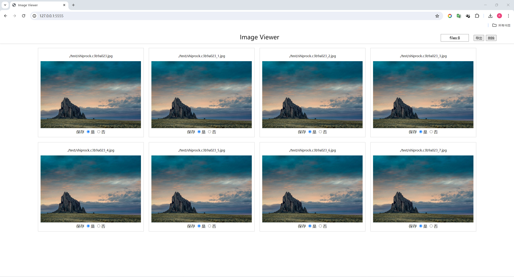

# ImageViewer

ImageViewer is a simple command line tool, implemented in python, designed to meet the needs of viewing images on the server side.

超级简单的服务端图片浏览工具,解决服务端无法查看图片的问题

---

## Function

#### Current Support Features

- View Images
- Export image file list as json
- Delete image

#### Future

- Datasets Image view
- Extend data labeling

## Install


### Install by pip

```
pip install git+https://github.com/JPChen2000/ImageViewer.git
```

```
git clone https://github.com/JPChen2000/ImageViewer.git
cd ImageViewer
pip install .
```

### Install by hand

```
git clone https://github.com/JPChen2000/ImageViewer.git

vim ~/.zshrc
alias imageview = "python /path/to/imageview.py"
source ~/.zshrc
```

## How to use

```
imageview [PATH] [PORT]
# imageview ./test 5555
```

## example


